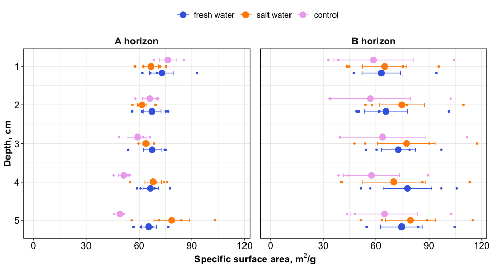
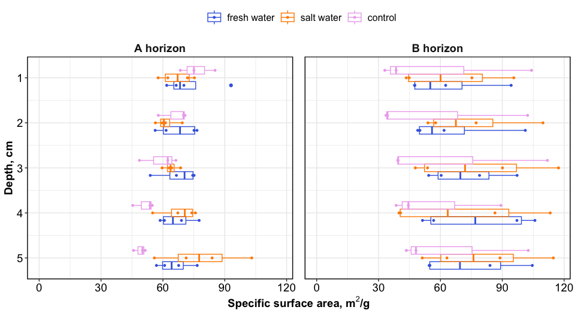
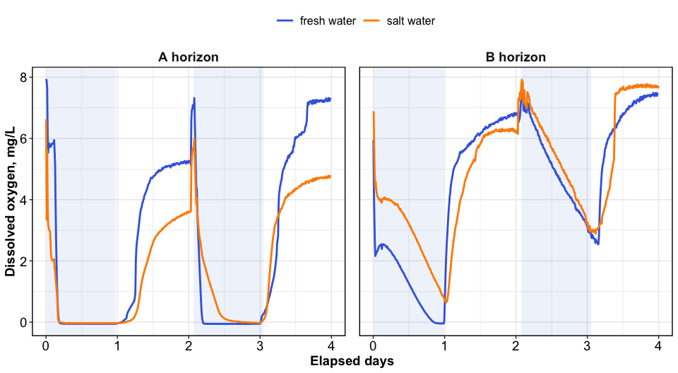
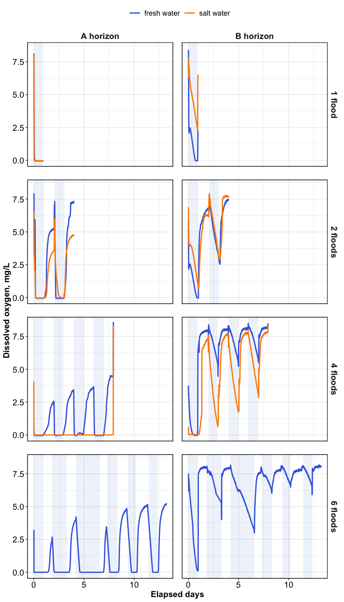
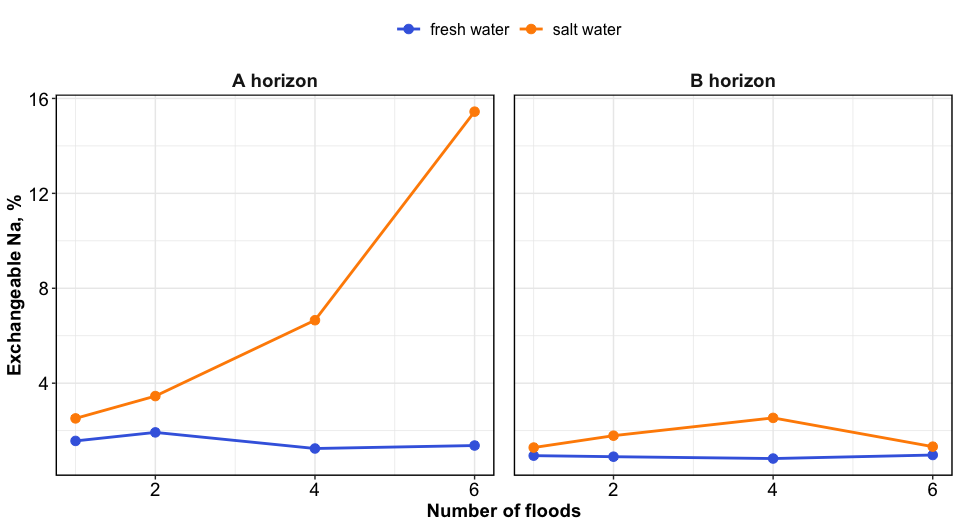
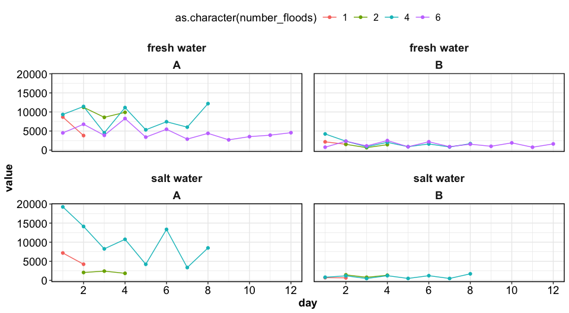
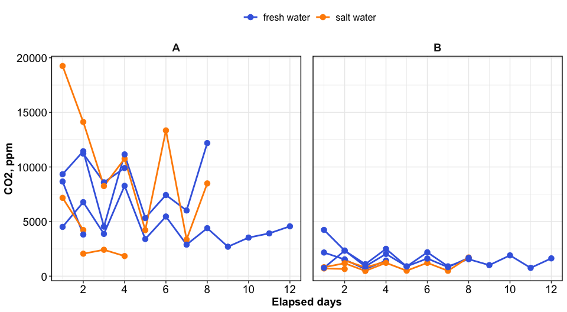

Flooding and Soil Structure
================

------------------------------------------------------------------------

## Specific Surface Area

<!-- --><!-- -->

------------------------------------------------------------------------

## Dissolved oxygen

<!-- -->

<!-- -->

------------------------------------------------------------------------

## Surface chemistry

<!-- -->

## Respiration

<!-- --><!-- -->

------------------------------------------------------------------------

## Session Info

Session Info

Date run: 2025-07-24

    ## R version 4.5.0 (2025-04-11)
    ## Platform: aarch64-apple-darwin20
    ## Running under: macOS Sequoia 15.5
    ## 
    ## Matrix products: default
    ## BLAS:   /Library/Frameworks/R.framework/Versions/4.5-arm64/Resources/lib/libRblas.0.dylib 
    ## LAPACK: /Library/Frameworks/R.framework/Versions/4.5-arm64/Resources/lib/libRlapack.dylib;  LAPACK version 3.12.1
    ## 
    ## locale:
    ## [1] en_US.UTF-8/en_US.UTF-8/en_US.UTF-8/C/en_US.UTF-8/en_US.UTF-8
    ## 
    ## time zone: America/Los_Angeles
    ## tzcode source: internal
    ## 
    ## attached base packages:
    ## [1] stats     graphics  grDevices utils     datasets  methods   base     
    ## 
    ## other attached packages:
    ##  [1] lubridate_1.9.4 forcats_1.0.0   stringr_1.5.1   dplyr_1.1.4    
    ##  [5] purrr_1.0.4     readr_2.1.5     tidyr_1.3.1     tibble_3.3.0   
    ##  [9] ggplot2_3.5.2   tidyverse_2.0.0
    ## 
    ## loaded via a namespace (and not attached):
    ##  [1] gtable_0.3.6       compiler_4.5.0     tidyselect_1.2.1   snakecase_0.11.1  
    ##  [5] scales_1.4.0       yaml_2.3.10        fastmap_1.2.0      R6_2.6.1          
    ##  [9] labeling_0.4.3     generics_0.1.3     knitr_1.50         janitor_2.2.1     
    ## [13] pillar_1.10.2      RColorBrewer_1.1-3 tzdb_0.5.0         rlang_1.1.6       
    ## [17] stringi_1.8.7      xfun_0.52          timechange_0.3.0   cli_3.6.5         
    ## [21] withr_3.0.2        magrittr_2.0.3     digest_0.6.37      grid_4.5.0        
    ## [25] rstudioapi_0.17.1  hms_1.1.3          lifecycle_1.0.4    vctrs_0.6.5       
    ## [29] evaluate_1.0.3     glue_1.8.0         farver_2.1.2       rmarkdown_2.29    
    ## [33] tools_4.5.0        pkgconfig_2.0.3    htmltools_0.5.8.1

