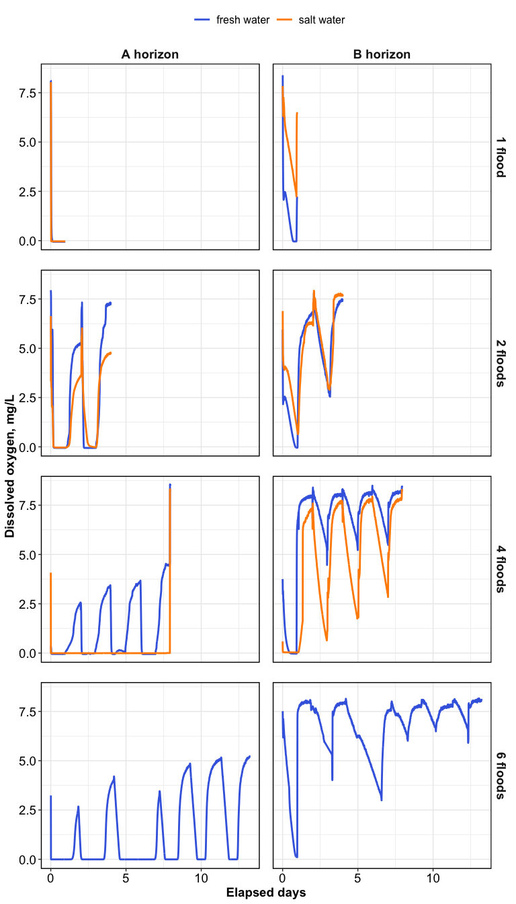

Flooding and Soil Structure
================

------------------------------------------------------------------------

## Specific Surface Area

<!-- --><!-- -->

------------------------------------------------------------------------

## Dissolved oxygen

<!-- -->

<!-- -->

------------------------------------------------------------------------

## Surface chemistry

<!-- -->

------------------------------------------------------------------------

## Session Info

Session Info

Date run: 2025-01-13

    ## R version 4.2.1 (2022-06-23)
    ## Platform: x86_64-apple-darwin17.0 (64-bit)
    ## Running under: macOS Big Sur ... 10.16
    ## 
    ## Matrix products: default
    ## BLAS:   /Library/Frameworks/R.framework/Versions/4.2/Resources/lib/libRblas.0.dylib
    ## LAPACK: /Library/Frameworks/R.framework/Versions/4.2/Resources/lib/libRlapack.dylib
    ## 
    ## locale:
    ## [1] en_US.UTF-8/en_US.UTF-8/en_US.UTF-8/C/en_US.UTF-8/en_US.UTF-8
    ## 
    ## attached base packages:
    ## [1] stats     graphics  grDevices utils     datasets  methods   base     
    ## 
    ## other attached packages:
    ##  [1] lubridate_1.9.2 forcats_1.0.0   stringr_1.5.0   dplyr_1.1.4    
    ##  [5] purrr_1.0.2     readr_2.1.4     tidyr_1.3.1     tibble_3.2.1   
    ##  [9] ggplot2_3.5.1   tidyverse_2.0.0
    ## 
    ## loaded via a namespace (and not attached):
    ##  [1] highr_0.9         pillar_1.9.0      compiler_4.2.1    tools_4.2.1      
    ##  [5] digest_0.6.29     timechange_0.2.0  evaluate_0.16     lifecycle_1.0.3  
    ##  [9] gtable_0.3.0      pkgconfig_2.0.3   rlang_1.1.4.9000  cli_3.6.3        
    ## [13] rstudioapi_0.16.0 yaml_2.3.5        xfun_0.42         fastmap_1.1.0    
    ## [17] janitor_2.2.0     withr_2.5.0       knitr_1.42        generics_0.1.3   
    ## [21] vctrs_0.6.5       hms_1.1.2         grid_4.2.1        tidyselect_1.2.0 
    ## [25] snakecase_0.11.0  glue_1.6.2        R6_2.5.1          fansi_1.0.3      
    ## [29] rmarkdown_2.21    farver_2.1.1      tzdb_0.4.0        magrittr_2.0.3   
    ## [33] scales_1.3.0      htmltools_0.5.7   ellipsis_0.3.2    colorspace_2.0-3 
    ## [37] labeling_0.4.2    utf8_1.2.2        stringi_1.7.8     munsell_0.5.0

